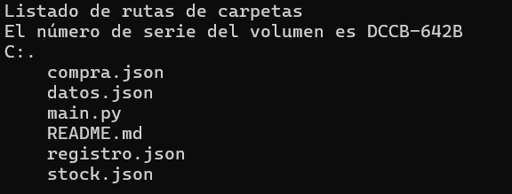

# PanCamp

sistema integral de gestión de la administración de productos, proveedores, empleados, clientes, así como la generación de informes relevantes.

# Índice

1. [Estado del Proyecto](#id1)
2. [Descripción del Proyecto](#id2)
3. [Tecnologías Utilizadas](#id3)
4. [Estructura del proyecto](#id4)
5. [Características](#id5)
6. [Diseño](#id6)
7. [Instrucciones](#id7)
8. [Personas Desarrolladoras del Proyecto](#id8)

# Estado del proyecto

Finalizado

# Descripción del Proyecto

### Gestión de Ventas y Compras

**Ventas:**
El sistema permite registrar cada transacción de venta con la siguiente información:

- Fecha de la venta.
- Información del cliente (nombre, dirección).
- Información del empleado que realizó la venta (nombre, cargo).
- Productos vendidos (nombre, cantidad, precio).

**Compras:**
El sistema permite registrar cada compra realizada a los proveedores con la siguiente información:

- Fecha de la compra.
- Información del proveedor (nombre, contacto).
- Productos comprados (nombre, cantidad, precio de compra).

### Generación de Informes

**Informes de ventas:**
Listado de todas las ventas realizadas en un período de tiempo específico, incluyendo detalles de los productos vendidos y el total de ingresos.

**Informes de stock:**
Listado de todos los productos con su cantidad en stock para gestionar de manera proactiva los inventarios.

# Tecnologías utilizadas

* Python

# Estructura del proyecto

# Características

Archivos Fundamentales:

**main.py**: Este archivo es el corazón del sistema. Contiene el código que maneja la parte lógica del programa, es fundamental para que funcione el sistema.

**compra.json**: Aquí se guarda la información de las compras realizadas a los proveedores.

**registro.json**: Aquí se guarda la información de cada venta realizada.

**stock.json**: Aquí se guarda la información de cada producto del inventario (nombre, precio, cantidad). La cantidad de productos en stock cambia según compres o vendas productos.

**datos.json**: Aquí se encuentran solo los nombres de los productos en stock.

# Diseño

* Solo puede ser visto y usado en consola

# Instrucciones

1. Clonar el repositorio
~~~
https://github.com/JesusBustamante/Filtro_python_BustamanteJesus.git
~~~

2. Si es clonado en Visual Studio Code, descargue la extensión de Python.

3. También descargue python desde un navegador web o la microsoft store.

3. Ejecuta el programa en la terminal de GitBash de la siguiente forma: 
~~~ 
python main.py 
~~~

# Personas Desarrolladoras del Proyecto

Este proyecto fue desarrollado por Jesús Leonardo Bustamante Ramírez, estudiante de Campuslands, como trabajo requerido para el módulo de Git.